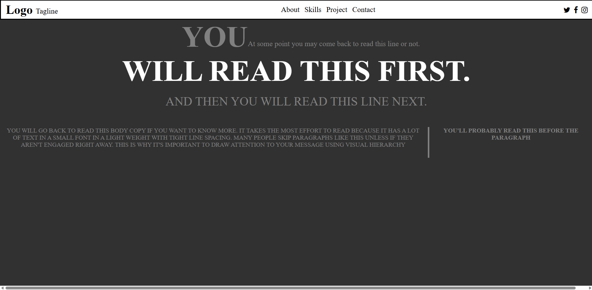

# Typography Design Challenge Website

A website with visually interesting typography made for the ITOnlineLearning HTML and Web essentials programme.

Live Demo: https://typography-design-challenge-website.vercel.app/

---

## Table of Contents

- [Overview](#overview)
- [Features](#features)
- [Tech Stack](#tech-stack)
- [Screenshots](#screenshots)
- [Deployment](#deployment)
- [Future Improvements](#future-improvements)
- [Credits](#credits)

---

## Overview
As part of the ITOnlineLearning HTML and Web essentials programme, I was tasked with completing several coding projects. One of them was to create a simple website that has varied and visually interesting typography using HTML and CSS.

### Motivation
The design shown in the design-to-copy.png served as inspiration as I was tasked with replicating that design.

### Objective
I was given an image with a design to be replicated. The objective of this project was to replicate the design shown in that image as best as possible.

### Learning Outcomes
- Use CSS to create a visually interesting website

---

## Features
- Visually interesting typography

---

## Tech Stack

### Frontend
- HTML
- CSS

---

## Screenshots

---

## Deployment

- Frontend deployed on Vercel

---

## Credits

Developer: Ifath Chowdhury
GitHub: https://github.com/Ifath-Chowdhury
